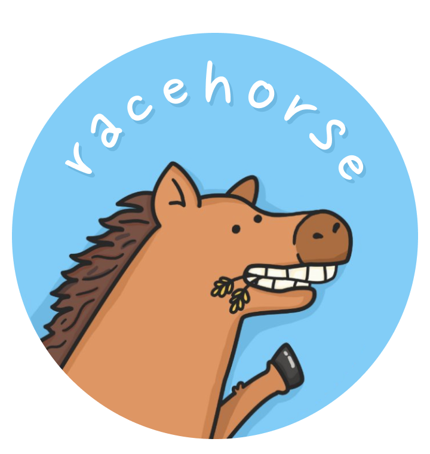

<p align="center">
  
</p>

The bootstrapper for `WebView`-based Android apps.

🚀&ensp;**Features**

- [Basics](#basics)
- [Request-response event chains](#request-response-event-chains)
- [Event subscriptions](#event-subscriptions)
- [Proguard](#proguard)

🔌&ensp;**Plugins**

- [Activity](#activity-plugin)
- [Asset loader](#asset-loader-plugin)
- [DeepLink](#deeplink-plugin)
- [Device](#device-plugin)
- [Encrypted storage](#encrypted-storage-plugin)
- [Evergreen](#evergreen-plugin)
- [Facebook Login](#facebook-login-plugin)
- [Facebook Sharing](#facebook-sharing-plugin)
- [File chooser](#file-chooser-plugin)
- [Firebase](#firebase-plugin)
- [Google Play referrer](#google-play-referrer-plugin)
- [Google Sign-In](#google-sign-in-plugin)
- [HTTPS](#https-plugin)
- [Keyboard](#keyboard-plugin)
- [Network](#network-plugin)
- [Notifications](#notifications-plugin)
- [Permissions](#permissions-plugin)

# How to run the example app?

1. Clone this repo:

```shell
git clone git@github.com:smikhalevski/racehorse.git
cd racehorse
```

2. Install packages and build Racehorse:

```shell
npm install
npm run build
```

3. Start the web server that would serve the app for the debug build:

```shell
cd web/example
npm run watch
```

4. Open `<racehorse>/android` in Android Studio and run `example` app.

# Basics

Racehorse is the pluggable bridge that marshals events between the web app and the native Android app. To showcase how
Racehorse works, let's create a plugin that would display
[an Android-native toast](https://developer.android.com/guide/topics/ui/notifiers/toasts) when the web app requests it.

Let's start by creating the `WebView`:

```kotlin
import android.webkit.WebView

val webView = WebView(activityOrContext)
// or
// val webView = activity.findViewById<WebView>(R.id.web_view)
```

Create an `EventBridge` instance that would be responsible for event marshalling:

```kotlin
import org.racehorse.EventBridge

val eventBridge = EventBridge(webView)
```

Racehorse uses a [Greenrobot EventBus](https://greenrobot.org/eventbus) to deliver events to subscribers, so bridge must
be registered in the event bus:

```kotlin
import org.greenrobot.eventbus.EventBus

EventBus.getDefault().register(eventBridge)
```

Here's an event that is posted from the web to Android through the bridge:

```kotlin
package com.example

import org.racehorse.WebEvent

class ShowToastEvent(val message: String) : WebEvent
```

Note that `ShowToastEvent` implements `WebEvent` marker interface. This is the baseline requirement to which events
must conform to support marshalling from the web app to Android.

Now let's add an event subscriber that would receive incoming `ShowToastEvent` and display a toast:

```kotlin
package com.example

import android.content.Context
import android.widget.Toast
import org.greenrobot.eventbus.Subscribe

class ToastPlugin(val context: Context) {

    @Subscribe
    fun onShowToast(event: ShowToastEvent) {
        Toast.makeText(context, event.message, Toast.LENGTH_SHORT).show()
    }
}
```

To enable `ToastPlugin` plugin, it should be registered in the event bus as well:

```kotlin
EventBus.getDefault().register(ToastPlugin(activityOrContext))
```

Now the native part is set up, and we can send an event from the web app:

```js
import { eventBridge } from 'racehorse';

eventBridge.requestAsync({
  // 🟡 The event class name
  type: 'com.example.ShowToastEvent',
  message: 'Hello, world!'
});
```

The last step is to load the web app into the `webView`. You can do this in any way that fits your needs, Racehorse
doesn't restrict this process in any way. For example, if your web app is running on your local machine on the port
1234, then you can load the web app in the web view using this snippet:

```kotlin
webView.loadUrl("https://10.0.2.2:1234")
```

# Request-response event chains

In the [Basics](#basics) section we used an event that extends a `WebEvent` interface. Such events don't imply the
response. To create a request-response chain at least two events are required:

```kotlin
package com.example

import android.os.Build
import org.greenrobot.eventbus.Subscribe
import org.racehorse.RequestEvent
import org.racehorse.ResponseEvent

class GetDeviceModelRequestEvent : RequestEvent()

class GetDeviceModelResponseEvent(val deviceModel: String) : ResponseEvent()

class DeviceModelPlugin {

    @Subscribe
    fun onGetDeviceModel(event: GetDeviceModelRequestEvent) {
        event.respond(GetDeviceModelResponseEvent(Build.MODEL))
    }
}
```

Request and response events are instances of `ChainableEvent`. Events in the chain share the same `requestId`. When a
`ResponseEvent` is posted to the event bus it is marshalled to the web app and resolves a promise returned from the
`eventBridge.request`:

```ts
import { eventBridge } from 'racehorse';

const deviceModel = await eventBridge
  .requestAsync({ type: 'com.example.GetDeviceModelRequestEvent' })
  .then(event => event.payload.deviceModel)
```

If an exception is thrown in `DeviceModelPlugin.onGetDeviceModel`, then promise is _rejected_ with an `Error` instance.

## Synchronous requests

If all events in the event chain are handled on
[the posting thread](https://greenrobot.org/eventbus/documentation/delivery-threads-threadmode/) on the Android side,
then a request can be handled synchronously on the web side. In the `DeviceModelPlugin` example `onGetDeviceModel` is
called on the posting thread, since we didn't specify a thread mode for `@Subscribe` annotation. So this allows web to
use a synchronous request:

```ts
import { eventBridge } from 'racehorse';

const { deviceModel } = eventBridge.request({ type: 'com.example.GetDeviceModelRequestEvent' }).payload;
```

If your app initializes an event bridge after the web view was created, you may need to establish the connection
manually before using synchronous requests:

```ts
await eventBridge.connect();
```

# Event subscriptions

While web can post a request event to the Android, it is frequently required that the Android would post an event to the
web app without an explicit request. This can be achieved using subscriptions.

Let's define an event that the Android can post to the web:

```kotlin
package com.example

import org.racehorse.NoticeEvent

class BatteryLowEvent : NoticeEvent
```

To receive this event in the web app, add a listener:

```js
import { eventBridge } from 'racehorse';

eventBridge.subscribe(event => {
  if (event.type === 'com.example.BatteryLowEvent') {
    // Handle the event here
  }
});
```

To subscribe to an event of the given type, you can use a shortcut:

```js
import { eventBridge } from 'racehorse';

eventBridge.subscribe('com.example.BatteryLowEvent', payload => {
  // Handle the event payload here
});
```

If you have [an `EventBridge` registered](#basics) in the event bus, then you can post `BatteryLowEvent` event from
anywhere in your Android app, and it would be delivered to a subscriber in the web app:

```kotlin
EventBus.getDefault().post(BatteryLowEvent())
```

# Proguard

`org.racehorse:racehorse` is an Android library (AAR) that provides its own
[proguard rules](./android/racehorse/proguard-rules.pro), so no additional action is needed. Proguard rules prevent
obfuscation of events and related classes which are available in Racehorse.

# Activity plugin

See [`ActivityManager`](https://smikhalevski.github.io/racehorse/interfaces/racehorse.ActivityManager.html) in the docs.

Starts activities and provides info about the activity that renders the web view.

1. Initialize the plugin in your Android app:

```kotlin
import org.racehorse.ActivityPlugin

EventBus.getDefault().register(ActivityPlugin(activity))
```

2. Start the activity, for example to open settings app and navigate user to the notification settings:

```ts
import { activityManager, Intent } from 'racehorse';

activityManager.startActivity({
  action: 'android.settings.APP_NOTIFICATION_SETTINGS',
  flags: Intent.FLAG_ACTIVITY_NEW_TASK,
  extras: {
    'android.provider.extra.APP_PACKAGE': activityManager.getActivityInfo().packageName,
  },
});
```

# Asset loader plugin

# DeepLink plugin

# Device plugin

# Encrypted storage plugin

# Evergreen plugin


# Facebook Login plugin

Enables Facebook Login support.

1. Go to [developers.facebook.com](https://developers.facebook.com/docs/facebook-login/android/) and register your app.

2. Initialize the Facebook SDK and register the plugin in your Android app:

```kotlin
import com.facebook.FacebookSdk
import org.racehorse.FacebookLoginPlugin

FacebookSdk.sdkInitialize(activity)

EventBus.getDefault().register(FacebookLoginPlugin(activity))
```

3. Request sign in from the web app that is loaded into the web view:

```ts
import { facebookLoginManager } from 'racehorse';

facebookLoginManager.logIn().then(accessToken => {
  // The accessToken is not-null if log in succeeded
});
```

# Facebook Sharing plugin

# File chooser plugin

# Firebase plugin

# Google Play referrer plugin

# Google Sign-In plugin

Enables Google Sign-In support.

1. Go to [console.firebase.google.com](https://console.firebase.google.com), set up a new project, and configure an
   Android app following all instructions. Use the `applicationId` of your app and SHA-1 that is used for app signing.
   You can use gradle to retrieve SHA-1:

```shell
./gradlew signingReport
```

2. Register the plugin in your Android app:

```kotlin
import org.racehorse.GoogleSignInPlugin

EventBus.getDefault().register(GoogleSignInPlugin(activity))
```

3. Request sign in from the web app that is loaded into the web view:

```ts
import { googleSignInManager } from 'racehorse';

googleSignInManager.signIn().then(account => {
  // The account is not-null if sign in succeeded
});
```

# HTTPS plugin

# Keyboard plugin

# Network plugin

# Notifications plugin

# Permissions plugin
