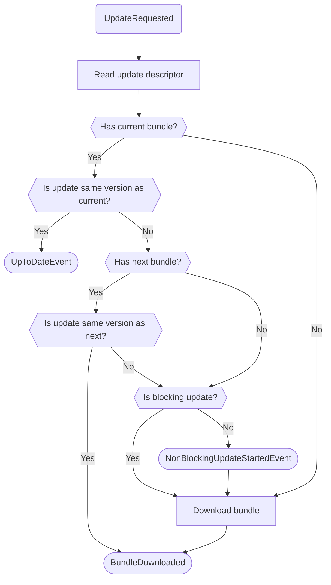

# webview-android-app

```mermaid
graph TD

UpdateRequested(UpdateRequested)
--> ReadUpdateDescriptor[Read update descriptor]
--> HasCurrentBundle

HasCurrentBundle{{Has current bundle?}}
-->|Yes| IsUpdateSameVersionAsCurrent{{Is update same version as current?}}

HasCurrentBundle
-->|No| DownloadBundle[Download bundle]

IsUpdateSameVersionAsCurrent
-->|Yes| UpToDateEvent([UpToDateEvent])

IsUpdateSameVersionAsCurrent
-->|No| HasNextBundle{{Has next bundle?}} 

HasNextBundle
-->|Yes| IsUpdateSameVersionAsNext{{Is update same version as next?}}

HasNextBundle
-->|No| IsBlockingUpdate{{Is blocking update?}}
-->|Yes| DownloadBundle

IsBlockingUpdate
-->|No| NonBlockingUpdateStartedEvent([NonBlockingUpdateStartedEvent])
--> DownloadBundle

IsUpdateSameVersionAsNext
-->|Yes| BundleDownloaded([BundleDownloaded])

IsUpdateSameVersionAsNext
-->|No| IsBlockingUpdate

DownloadBundle
--> BundleDownloaded
```