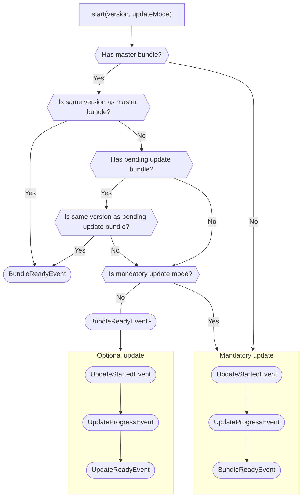

<p align="center">
  <a href="#readme"><picture>
    <source media="(prefers-color-scheme: dark)" srcset="./images/logo-dark.png" />
    <source media="(prefers-color-scheme: light)" srcset="./images/logo-light.png" />
    
  </picture></a>
</p>

<br/>

<!--ARTICLE-->

<!--OVERVIEW-->

The pluggable bridge for WebView-based Android apps that marshals events between the web layer and native Android.

- Kotlin and TypeScript first.
- Plugin-based architecture.
- Can be integrated into any Android 28+ app.
- Enables [app auto updates](#evergreen-plugin) without Google Play releases.
- First-class React support.
- Check out the [example app](#example-app) and the [Cookbook](#cookbook)!

<!--/OVERVIEW-->

<br>

```sh
npm install --save-prod racehorse
```

<br>

<!--/ARTICLE-->

<!--TOC-->

- [API docs](https://smikhalevski.github.io/racehorse/)

<span class="toc-icon">🚀&ensp;</span>**Features**

- [Overview](#overview)
- [Example app](#example-app)
- [Request-response event chains](#request-response-event-chains)
- [Event subscriptions](#event-subscriptions)
- [WebView events](#webview-events)
- [Check supported events](#check-supported-events)
- [Proguard](#proguard)

<span class="toc-icon">🔌&ensp;</span>**Plugins**

- [Activity](#activity-plugin)
- [Asset loader](#asset-loader-plugin)
- [Biometric](#biometric-plugin)
- [Biometric encrypted storage](#biometric-encrypted-storage-plugin)
- [Contacts](#contacts-plugin)
- [Deep link](#deep-link-plugin)
- [Device](#device-plugin)
- [Downloads](#download-plugin)
- [Encrypted storage](#encrypted-storage-plugin)
- [Evergreen](#evergreen-plugin)
- [Facebook Login](#facebook-login-plugin)
- [Facebook Share](#facebook-share-plugin)
- [File chooser](#file-chooser-plugin)
- [File system](#file-system-plugin)
- [Google Pay](#google-pay-plugin)
- [Google Play referrer](#google-play-referrer-plugin)
- [Google Sign-In](#google-sign-in-plugin)
- [HTTPS](#https-plugin)
- [Keyboard](#keyboard-plugin)
- [Network](#network-plugin)
- [Notifications](#notifications-plugin)
- [Permissions](#permissions-plugin)

<span class="toc-icon">🍪&ensp;</span>**Cookbook**

- [Blur preview on recent apps screen](#blur-preview-on-recent-apps-screen)

<!--/TOC-->

<!--ARTICLE-->

# Overview

Racehorse is the pluggable bridge that marshals events between the web app and the native Android app. To showcase how
Racehorse works, let's create a plugin that would display
[an Android-native toast](https://developer.android.com/guide/topics/ui/notifiers/toasts) when the web app requests it.

Let's start by adding required Racehorse dependencies. In your `app/build.gradle.kts` add:

```kotlin
plugins {
    id("org.jetbrains.kotlin.plugin.serialization")
}

dependencies {
    implementation("org.racehorse:racehorse:1.10.1")
    implementation("org.greenrobot:eventbus:3.3.1")
    implementation("org.jetbrains.kotlinx:kotlinx-serialization-json:1.3.3")
}
```

In root-level `build.gradle.kts` add:

```kotlin
plugins {
    id("org.jetbrains.kotlin.plugin.serialization")
}
```

Install web dependencies:

```shell
npm install racehorse
```

If you're planning to use React, consider a Racehorse React integration package:

```shell
npm install @racehorse/react
```

In Android app, create a WebView:

```kotlin
import android.webkit.WebView

val webView = WebView(activity)
// or
// val webView = activity.findViewById<WebView>(R.id.web_view)
```

Create an
[`EventBridge`](https://smikhalevski.github.io/racehorse/android/racehorse/org.racehorse/-event-bridge/index.html)
instance that would be responsible for event marshalling:

```kotlin
import org.racehorse.EventBridge

val eventBridge = EventBridge(webView).apply { enable() }
```

Racehorse uses a [Greenrobot EventBus](https://greenrobot.org/eventbus) to deliver events to subscribers, so the bridge
must be registered in the event bus:

```kotlin
import org.greenrobot.eventbus.EventBus

EventBus.getDefault().register(eventBridge)
```

Here's an event that is posted from the web to Android through the bridge:

```kotlin
package com.example

import kotlinx.serialization.Serializable
import org.racehorse.WebEvent

@Serializable
class ShowToastEvent(val message: String) : WebEvent
```

Note that `ShowToastEvent` implements the
[`WebEvent`](https://smikhalevski.github.io/racehorse/android/racehorse/org.racehorse/-web-event/index.html)
marker interface. This is the baseline requirement that events must conform to in order to support marshalling from the
web app to Android.

Now let's add an event subscriber that would receive incoming `ShowToastEvent` and display a toast:

```kotlin
package com.example

import android.content.Context
import android.widget.Toast
import org.greenrobot.eventbus.Subscribe

class ToastPlugin(val context: Context) {

    @Subscribe
    fun onShowToast(event: ShowToastEvent) {
        Toast.makeText(context, event.message, Toast.LENGTH_SHORT).show()
    }
}
```

Register `ToastPlugin` in the event bus to enable event subscriptions:

```kotlin
EventBus.getDefault().register(ToastPlugin(activity))
```

Now the native part is set up, and we can send an event from the web app:

```js
import { eventBridge } from 'racehorse';

eventBridge.requestAsync({
  // 🟡 The event class name
  type: 'com.example.ShowToastEvent',
  payload: {
    message: 'Hello, world!',
  },
});
```

The last step is to load the web app into the WebView. You can do this in any way that fits your needs — Racehorse
doesn't restrict this process in any way. For example, if your web app is running on your local machine on port 1234,
you can load the web app in the WebView using this snippet:

```kotlin
webView.loadUrl("https://10.0.2.2:1234")
```

# Example app

The example app consists of two parts: [the web app](https://github.com/smikhalevski/racehorse/tree/master/web/example)
and [the Android app](https://github.com/smikhalevski/racehorse/tree/master/android/example). To launch the app in the
emulator, follow the steps below.

Clone this repo:

```shell
git clone git@github.com:smikhalevski/racehorse.git
cd racehorse
```

Install packages and build Racehorse packages and the example app:

```shell
npm ci
npm run build
```

Start the web server that would serve the app for the debug build:

```shell
cd web/example
npm start
```

Open `<racehorse>/android` in Android Studio and run the `example` app.

# Request-response event chains

In the [Overview](#overview) section we used an event that extends the
[`WebEvent`](https://smikhalevski.github.io/racehorse/android/racehorse/org.racehorse/-web-event/index.html) interface.
Such events don't imply a response. To create a request-response chain, at least two events are required:

```kotlin
package com.example

import android.os.Build
import org.greenrobot.eventbus.Subscribe
import org.racehorse.RequestEvent
import org.racehorse.ResponseEvent

class GetDeviceModelRequestEvent : RequestEvent()

class GetDeviceModelResponseEvent(val deviceModel: String) : ResponseEvent()

class DeviceModelPlugin {

    @Subscribe
    fun onGetDeviceModel(event: GetDeviceModelRequestEvent) {
        event.respond(GetDeviceModelResponseEvent(Build.MODEL))
    }
}
```

Request and response events are instances of
[`ChainableEvent`](https://smikhalevski.github.io/racehorse/android/racehorse/org.racehorse/-chainable-event/index.html).
Events in the chain share the same `requestId`. When a
[`ResponseEvent`](https://smikhalevski.github.io/racehorse/android/racehorse/org.racehorse/-response-event/index.html)
is posted to the event bus, it is marshalled to the web app and resolves a promise returned from
[`eventBridge.requestAsync`](https://smikhalevski.github.io/racehorse/interfaces/racehorse.EventBridge.html#requestasync):

```ts
import { eventBridge } from 'racehorse';

const deviceModel = await eventBridge
  .requestAsync({ type: 'com.example.GetDeviceModelRequestEvent' })
  .then(event => event.payload.deviceModel);
```

If an exception is thrown in `DeviceModelPlugin.onGetDeviceModel`, the promise is _rejected_ with an
[`Error`](https://developer.mozilla.org/en-US/docs/Web/JavaScript/Reference/Global_Objects/Error) instance.

## Synchronous requests

If all events in the event chain are handled on
[the posting thread](https://greenrobot.org/eventbus/documentation/delivery-threads-threadmode/) on the Android side,
then a request can be handled synchronously on the web side. In the `DeviceModelPlugin` example, `onGetDeviceModel` is
called on the posting thread since we didn't specify a thread mode for the
[`@Subscribe`](https://github.com/greenrobot/EventBus#eventbus-in-3-steps) annotation. This allows the web to perform
a synchronous request:

```ts
import { eventBridge } from 'racehorse';

const { deviceModel } = eventBridge.request({ type: 'com.example.GetDeviceModelRequestEvent' }).payload;
```

If your app initializes an event bridge after the WebView was created, you may need to establish the connection
manually before using synchronous requests:

```ts
await eventBridge.connect();
```

# Event subscriptions

While the web app can post a request event to Android, it is frequently required that Android post an event to the web
app without an explicit request. This can be achieved using subscriptions.

Let's define an event that Android can post to the web:

```kotlin
package com.example

import org.racehorse.NoticeEvent

class BatteryLowEvent : NoticeEvent
```

To receive this event in the web app, add a listener:

```js
import { eventBridge } from 'racehorse';

eventBridge.subscribe(event => {
  if (event.type === 'com.example.BatteryLowEvent') {
    // Handle the event here
  }
});
```

To subscribe to an event of a given type, you can use a shortcut:

```js
import { eventBridge } from 'racehorse';

eventBridge.subscribe('com.example.BatteryLowEvent', payload => {
  // Handle the event payload here
});
```

If you have [an `EventBridge` registered](#overview) in the event bus, then you can post a `BatteryLowEvent` from
anywhere in your Android app and it will be delivered to a subscriber in the web app:

```kotlin
EventBus.getDefault().post(BatteryLowEvent())
```

# WebView events

Racehorse provides clients for the WebView which post WebView-related events to the event bus, so you can subscribe to
them in your plugins. To init clients, set them on the WebView instance:

```kotlin
import org.racehorse.webview.RacehorseWebChromeClient
import org.racehorse.webview.RacehorseWebViewClient

webView.webChromeClient = RacehorseWebChromeClient()
webView.webViewClient = RacehorseWebViewClient()
```

Now you can subscribe to
[all events that a WebView instance posts](https://smikhalevski.github.io/racehorse/android/racehorse/org.racehorse.webview/index.html):

```kotlin
import org.greenrobot.eventbus.Subscribe
import org.racehorse.webview.ConsoleMessageEvent

class MyPlugin {

    @Subscribe
    fun onConsoleMessage(event: ConsoleMessageEvent) {
        // Handle the event here
    }
}

EventBus.getDefault().register(MyPlugin())
```

# Check supported events

The web app can check that an event is supported by the Android binary. For example, to check that the app supports
Google Pay card tokenization, you can use:

```ts
import { eventBridge } from 'racehorse';

eventBridge.isSupported('org.racehorse.GooglePayTokenizeEvent');
// ⮕ true
```

# Proguard

`org.racehorse:racehorse` is an Android library (AAR) that provides its own
[proguard rules](https://github.com/smikhalevski/racehorse/tree/master/android/racehorse/proguard-rules.pro), so no
additional action is needed. Proguard rules prevent obfuscation of events and related classes available in Racehorse.

For example, this class and its members won't be minified:

```kotlin
class ShowToastEvent(val message: String) : WebEvent
```

# Activity plugin

[`ActivityManager`](https://smikhalevski.github.io/racehorse/interfaces/racehorse.ActivityManager.html) starts
activities and provides info about the activity that renders the WebView.

Add the Lifecycle dependency to your Android app:

```kotlin
dependencies {
    implementation("androidx.lifecycle:lifecycle-process:2.8.5")
}
```

Initialize the plugin in your Android app:

```kotlin
import org.racehorse.ActivityPlugin

EventBus.getDefault().register(ActivityPlugin().apply { enable() })
```

Start a new activity. For example, here's how to open the Settings app and navigate the user to notification settings:

```ts
import { activityManager, Intent } from 'racehorse';

activityManager.startActivity({
  action: 'android.settings.APP_NOTIFICATION_SETTINGS',
  flags: Intent.FLAG_ACTIVITY_NEW_TASK,
  extras: {
    'android.provider.extra.APP_PACKAGE': activityManager.getActivityInfo().packageName,
  },
});
```

Synchronously read the status of the current activity or subscribe to its changes:

```ts
import { activityManager, ActivityState } from 'racehorse';

activityManager.getActivityState();
// ⮕ ActivityState.BACKGROUND

activityManager.subscribe(state => {
  // React to activity state changes
});

activityManager.subscribe('foreground', () => {
  // React to activity entering foreground
});
```

If you are using React, refer to the
[`useActivityState`](https://smikhalevski.github.io/racehorse/functions/_racehorse_react.useActivityState.html)
hook, which re-renders a component when the activity state changes.

```tsx
import { useActivityState } from '@racehorse/react';

const state = useActivityState();
// ⮕ ActivityState.BACKGROUND
```

# Asset loader plugin

The asset loader plugin requires [WebView events](#webview-events) to be enabled.

Add the WebKit dependency:

```kotlin
dependencies {
    implementation("androidx.webkit:webkit:1.11.0")
}
```

Load static assets from a directory on the device when a particular URL is requested in the WebView:

```kotlin
import androidx.webkit.WebViewAssetLoader
import org.racehorse.AssetLoaderPlugin
import org.racehorse.StaticPathHandler

EventBus.getDefault().register(
    AssetLoaderPlugin(activity).apply {
        registerAssetLoader(
            "https://example.com",
            StaticPathHandler(File(activity.filesDir, "www"))
        )
    }
)

webView.loadUrl("https://example.com")
```

During development, if you're running a server on localhost, use `ProxyPathHandler` to serve content to the WebView:

```kotlin
AssetLoaderPlugin(activity).apply {
    registerAssetLoader(
        "https://example.com",
        ProxyPathHandler("http://10.0.2.2:10001")
    )
}
```

`AssetLoaderPlugin` will open a URL in an external browser app if it isn't handled by any of the registered asset
loaders. Since in the example above only `https://example.com` is handled by the asset loader, all other URLs are
opened externally:

```js
// This would open a browser app and load google.com
window.location.href = 'https://google.com';
```

To disable this behaviour:

```kotlin
AssetLoaderPlugin(activity).apply {
    isUnhandledRequestOpenedInExternalBrowser = false
}
```

# Biometric plugin

[`BiometricManager`](https://smikhalevski.github.io/racehorse/interfaces/racehorse.BiometricManager.html) provides
the status of biometric support and allows enrolling for biometric auth.

Add the [Biometric](https://developer.android.com/jetpack/androidx/releases/biometric#declaring_dependencies) dependency
to your Android app:

```kotlin
dependencies {
    implementation("androidx.biometric:biometric:1.2.0-alpha05")
}
```

Initialize the plugin in your Android app:

```kotlin
import org.racehorse.BiometricPlugin

EventBus.getDefault().register(BiometricPlugin(activity))
```

Read the biometric status or enroll biometric:

```ts
import { biometricManager, BiometricAuthenticator } from 'racehorse';

biometricManager.getBiometricStatus([BiometricAuthenticator.BIOMETRIC_WEAK]);
// ⮕ BiometricStatus.NONE_ENROLLED

biometricManager.enrollBiometric();
// ⮕ Promise<boolean>
```

# Biometric encrypted storage plugin

[`BiometricEncryptedStorageManager`](https://smikhalevski.github.io/racehorse/interfaces/racehorse.BiometricEncryptedStorageManager.html)
enables file-based persistence of biometric-protected data.

Add the [Biometric](https://developer.android.com/jetpack/androidx/releases/biometric#declaring_dependencies) dependency
to your Android app:

```kotlin
dependencies {
    implementation("androidx.biometric:biometric:1.2.0-alpha05")
}
```

Initialize the plugin in your Android app:

```kotlin
import org.racehorse.BiometricEncryptedStoragePlugin

EventBus.getDefault().register(
    BiometricEncryptedStoragePlugin(
        activity,

        // The directory where encrypted data is stored
        File(activity.filesDir, "biometric_storage")
    )
)
```

Read and write encrypted key-value pairs to the storage:

```ts
import { biometricEncryptedStorageManager, BiometricAuthenticator } from 'racehorse';

await biometricEncryptedStorageManager.set('foo', 'bar', {
  title: 'Authentication required',
  authenticators: [BiometricAuthenticator.BIOMETRIC_STRONG],
});
// ⮕ true

await biometricEncryptedStorageManager.get('foo');
// ⮕ 'bar'
```

To allow device credential authentication, provide an
[`authenticationValidityDuration`](https://smikhalevski.github.io/racehorse/interfaces/racehorse.BiometricConfig.html#authenticationvalidityduration)
value greater than or equal to 0:

```ts
await biometricEncryptedStorageManager.set('foo', 'bar', {
  authenticators: [BiometricAuthenticator.DEVICE_CREDENTIAL],
  authenticationValidityDuration: 0,
});
```

If a user enrolls biometric auth (for example, updates fingerprints stored on the device), all secret keys used by
the biometric-encrypted storage are invalidated and values become inaccessible.

```js
if (biometricEncryptedStorageManager.has(key)) {
  // Storage contains the key

  biometricEncryptedStorageManager.get(key).then(
    value => {
      if (value !== null) {
        // The value was successfully decrypted
      } else {
        // User authentication failed
      }
    },
    error => {
      if (error.name === 'KeyPermanentlyInvalidatedException') {
        // Key was invalidated and cannot be decrypted anymore
        biometricEncryptedStorageManager.delete(key);
      }
    }
  );
}
```

# Contacts plugin

[`ContactsManager`](https://smikhalevski.github.io/racehorse/interfaces/racehorse.ContactsManager.html) provides access
to contacts stored on the device.

Add the contacts permission to the app manifest:

```xml
<uses-permission android:name="android.permission.READ_CONTACTS"/>
```

Initialize the plugin in your Android app:

```kotlin
import org.racehorse.ContactsPlugin

EventBus.getDefault().register(ContactsPlugin(activity))
```

Ask a user to pick a contact or get a contact by its ID:

```ts
import { contactsManager } from 'racehorse';

contactsManager.pickContact();
// ⮕ Promise<Contact | null>

contactsManager.getContact(42);
// ⮕ Contact | null
```

# Deep link plugin

[`DeepLinkManager`](https://smikhalevski.github.io/racehorse/interfaces/racehorse.DeepLinkManager.html) provides access
to deep links inside your web app.

Initialize the plugin in your Android app:

```kotlin
import org.racehorse.DeepLinkPlugin

EventBus.getDefault().register(DeepLinkPlugin())
```

Override
[`onNewIntent`](<https://developer.android.com/reference/android/app/Activity#onNewIntent(android.content.Intent)>)
in the main activity of your app and post the deep link event:

```kotlin
override fun onNewIntent(intent: Intent) {
    super.onNewIntent(intent)

    eventBus.post(OpenDeepLinkEvent(intent))
}
```

Subscribe to new intents in the web app:

```ts
import { deepLinkManager } from 'racehorse';

deepLinkManager.subscribe(intent => {
  // Handle the deep link intent
});
```

# Device plugin

[`DeviceManager`](https://smikhalevski.github.io/racehorse/interfaces/racehorse.DeviceManager.html) provides access
to various device settings.

Add the compat library dependency, which is used for window insets acquisition:

```kotlin
dependencies {
    implementation("androidx.appcompat:appcompat:1.7.0")
}
```

Initialize the plugin in your Android app:

```kotlin
import org.racehorse.DevicePlugin

EventBus.getDefault().register(DevicePlugin(activity))
```

Synchronously get device info, locale, or other data:

```ts
import { deviceManager } from 'racehorse';

deviceManager.getDeviceInfo().apiLevel;
// ⮕ 33

deviceManager.getPreferredLocales();
// ⮕ ['en-US']
```

If you are using React, refer to the
[`useWindowInsets`](https://smikhalevski.github.io/racehorse/functions/_racehorse_react.useWindowInsets.html) hook
to synchronize document paddings and window insets:

```ts
import { useLayoutEffect } from 'react';
import { useWindowInsets } from '@racehorse/react';

const windowInsets = useWindowInsets();

useLayoutEffect(() => {
  document.body.style.padding =
    windowInsets.top + 'px ' + windowInsets.right + 'px ' + windowInsets.bottom + 'px ' + windowInsets.left + 'px';
}, [windowInsets]);
```

# Download plugin

[`DownloadManager`](https://smikhalevski.github.io/racehorse/interfaces/racehorse.DownloadManager.html) allows starting
and monitoring file downloads.

Initialize the plugin in your Android app:

```kotlin
import org.racehorse.DownloadPlugin

EventBus.getDefault().register(DownloadPlugin(activity))
```

Read previously started downloads or start a new one:

```ts
import { downloadManager } from 'racehorse';

downloadManager.addDownload('http://example.com/my.zip').then(id => {
  downloadManager.getDownload(id);
  // ⮕ Download { id: 1, status: 4, uri: 'http://example.com/my.zip' }
});

downloadManager.getAllDownloads();
```

A [`Download`](https://smikhalevski.github.io/racehorse/interfaces/racehorse.Download.html) instance carries the
download status, progress, and file details.

A storage permission must be added to support Android devices with API level <= 29:

```xml
<uses-permission
    android:name="android.permission.WRITE_EXTERNAL_STORAGE"
    tools:ignore="ScopedStorage"/>
```

## Android 29 support

On Android 29, a `SecurityException` is thrown when calling the deprecated method
[`DownloadManager.addCompletedDownload`](<https://developer.android.com/reference/android/app/DownloadManager#addCompletedDownload(java.lang.String,%20java.lang.String,%20boolean,%20java.lang.String,%20java.lang.String,%20long,%20boolean)>)
if the `android.permission.WRITE_EXTERNAL_STORAGE` permission isn't granted. This method is used by Racehorse to
populate the list of previous downloads when a data URI is downloaded. To fix this exception,
[the legacy external storage model](https://developer.android.com/training/data-storage/use-cases#opt-out-in-production-app)
must be enabled in the Android manifest for API level 29.

Create a resource file for default config values at `src/main/res/values/config.xml`:

```xml
<resources>
    <bool name="request_legacy_external_storage">false</bool>
</resources>
```

Create a resource file specific to API level 29 at `src/main/res/values-v29/config.xml`:

```xml
<resources>
    <bool name="request_legacy_external_storage">true</bool>
</resources>
```

Configure the legacy external storage setting in the Android manifest file:

```xml
<application
    android:requestLegacyExternalStorage="@bool/request_legacy_external_storage"
/>
```

## Downloadable links

Downloadable links have a [`download`](https://developer.mozilla.org/en-US/docs/Web/HTML/Element/a) attribute:

```html
<a
  href="data:image/gif;base64,R0lGODlhBwAGAJEAAAAAAP////RDNv///yH/C05FVFNDQVBFMi4wAwEAAAAh+QQFAAADACwAAAAABwAGAAACCpxkeMudOyKMkhYAOw=="
  download
>
  Download image
</a>
```

Initialize the
[`DownloadPlugin`](https://smikhalevski.github.io/racehorse/android/racehorse/org.racehorse/-download-plugin/index.html)
as described in the previous section, and add a Racehorse listener to enable automatic handling of downloadable links:

```kotlin
import org.racehorse.webview.RacehorseDownloadListener

webView.setDownloadListener(RacehorseDownloadListener())
```

# Encrypted storage plugin

[`EncryptedStorageManager`](https://smikhalevski.github.io/racehorse/interfaces/racehorse.EncryptedStorageManager.html)
enables file-based persistence of password-protected data.

Initialize the plugin in your Android app:

```kotlin
import org.racehorse.EncryptedStoragePlugin

EventBus.getDefault().register(
    EncryptedStoragePlugin(
        // The directory where encrypted data is stored
        File(activity.filesDir, "storage"),

        // The salt required to generate the encryption key
        BuildConfig.APPLICATION_ID.toByteArray()
    )
)
```

Read and write encrypted key-value pairs to the storage:

```ts
import { encryptedStorageManager } from 'racehorse';

const PASSWORD = '12345';

await encryptedStorageManager.set('foo', 'bar', PASSWORD);
// ⮕ true

await encryptedStorageManager.get('foo', PASSWORD);
// ⮕ 'bar'
```

# Evergreen plugin

[`EvergreenManager`](https://smikhalevski.github.io/racehorse/interfaces/racehorse.EvergreenManager.html) provides
a way to update your app using an archive downloadable from your server.

You can find an extensive demo of evergreen plugin usage [in the example app](#example-app).

Init the plugin and start the update download process:

```kotlin
import android.os.Bundle
import androidx.appcompat.app.AppCompatActivity
import org.racehorse.evergreen.EvergreenPlugin

class MyActivity : AppCompatActivity() {

    override fun onCreate(savedInstanceState: Bundle?) {
        super.onCreate(savedInstanceState)

        val evergreenPlugin = EvergreenPlugin(File(filesDir, "app"))

        EventBus.getDefault().register(evergreenPlugin)

        Thread {
            // 🟡 Start the update process
            evergreenPlugin.start(version = "1.0.0", updateMode = UpdateMode.MANDATORY) {
                URL("http://example.com/bundle.zip").openConnection()
            }
        }.start()
    }
}
```

The snippet above downloads `bundle.zip`, unpacks it, and stores the assets in the `<filesDir>/app` directory. These
assets are labeled as version 1.0.0. During future app launches, the plugin will notice it already has the assets for
version 1.0.0 and will skip the download. If the version changes, the update bundle will be downloaded again.

After the update is downloaded, a
[`BundleReadyEvent`](https://smikhalevski.github.io/racehorse/android/racehorse/org.racehorse.evergreen/-bundle-ready-event/index.html)
event is posted. You can use the [`AssetLoaderPlugin`](#asset-loader-plugin) to load resources provided by the evergreen
plugin:

```kotlin
@Subscribe(threadMode = ThreadMode.MAIN)
fun onBundleReady(event: BundleReadyEvent) {

    EventBus.getDefault().register(
        // Loads static assets when a particular URL is requested
        AssetLoaderPlugin(
            activity,
            WebViewAssetLoader.Builder()
                .setDomain("example.com")
                .addPathHandler(
                    "/",
                    // 🟡 Use assets provided by the evergreen plugin
                    StaticPathHandler(event.appDir)
                )
                .build()
        )
    )

    webView.loadUrl("https://example.com")
}
```

Evergreen plugin keeps track of downloaded bundles:

- The master bundle contains the current assets of the web app.
- The pending update bundle contains assets that were downloaded but not yet applied as master.

<!--HIDDEN-->

Below is the diagram of events posted by the evergreen plugin.


```mermaid
graph TD

start["start(version, updateMode)"]
--> HasMasterBundle

HasMasterBundle{{Has master bundle?}}
-->|Yes| IsSameVersionAsMasterBundle{{Is same version as master bundle?}}

HasMasterBundle
-->|No| MandatoryUpdate

IsSameVersionAsMasterBundle
-->|Yes| MainBundleReadyEvent([BundleReadyEvent])

IsSameVersionAsMasterBundle
-->|No| HasPendingUpdateBundle{{Has pending update bundle?}}

HasPendingUpdateBundle
-->|Yes| IsSameVersionAsPendingUpdateBundle{{Is same version as pending update bundle?}}

IsSameVersionAsPendingUpdateBundle
-->|Yes| MainBundleReadyEvent

IsSameVersionAsPendingUpdateBundle
-->|No| IsMandatoryUpdateMode

HasPendingUpdateBundle
-->|No| IsMandatoryUpdateMode{{Is mandatory update mode?}}

IsMandatoryUpdateMode
---|No| BundleReadyEvent(["BundleReadyEvent ¹"])
--> OptionalUpdate

IsMandatoryUpdateMode
--->|Yes| MandatoryUpdate

subgraph OptionalUpdate [Optional update]
direction TB
OptionalUpdateStartedEvent([UpdateStartedEvent])
--> OptionalUpdateProgressEvent([UpdateProgressEvent])
--> OptionalUpdateReadyEvent([UpdateReadyEvent])
end

subgraph MandatoryUpdate [Mandatory update]
direction TB
MandatoryUpdateStartedEvent([UpdateStartedEvent])
--> MandatoryUpdateProgressEvent([UpdateProgressEvent])
--> MandatoryBundleReadyEvent([BundleReadyEvent])
end
```

¹ The app is started with the assets from the available master bundle while the update is downloaded in the background.

<!--/HIDDEN-->

You can monitor background updates and apply them as soon as they are ready:

```ts
import { evergreenManager } from 'racehorse';

// 1️⃣ Wait for the update bundle to be downloaded
evergreenManager.subscribe('ready', () => {
  // 2️⃣ Apply the update
  evergreenManager.applyUpdate().then(() => {
    // 3️⃣ Reload the web app to use the latest assets
    window.location.reload();
  });
});
```

# Facebook Login plugin

[`FacebookLoginManager`](https://smikhalevski.github.io/racehorse/interfaces/racehorse.FacebookLoginManager.html)
enables Facebook Login support.

Go to [developers.facebook.com](https://developers.facebook.com/docs/facebook-login/android/), register your app, and
add the required dependencies and configurations.

Initialize the Facebook SDK and register the plugin in your Android app:

```kotlin
import com.facebook.FacebookSdk
import org.racehorse.FacebookLoginPlugin

FacebookSdk.sdkInitialize(activity)

EventBus.getDefault().register(FacebookLoginPlugin(activity))
```

Request sign-in from the web app loaded into the WebView:

```ts
import { facebookLoginManager } from 'racehorse';

facebookLoginManager.logIn().then(accessToken => {
  // The accessToken is non-null if log-in succeeded
});
```

# Facebook Share plugin

[`FacebookShareManager`](https://smikhalevski.github.io/racehorse/interfaces/racehorse.FacebookShareManager.html)
enables Facebook social sharing.

Go to [developers.facebook.com](https://developers.facebook.com/docs/facebook-login/android/), register your app, and
add the required dependencies and configurations.

Initialize the Facebook SDK and register the plugin in your Android app:

```kotlin
import com.facebook.FacebookSdk
import org.racehorse.FacebookSharePlugin

FacebookSdk.sdkInitialize(activity)

EventBus.getDefault().register(FacebookSharePlugin(activity))
```

Trigger the Facebook social sharing flow:

```ts
import { facebookShareManager } from 'racehorse';

facebookShareManager.shareLink({
  contentUrl: 'http://example.com',
});
```

# File chooser plugin

The file chooser plugin requires [WebView events](#webview-events) to be enabled. This plugin enables file inputs in
the web app.

For example, if you have a file input:

```html
<input type="file" />
```

You can register a plugin to make this input open a file chooser dialog:

```kotlin
import org.racehorse.FileChooserPlugin

EventBus.getDefault().register(FileChooserPlugin(activity))
```

If you don't need camera support for file inputs, the plugin doesn't require any additional configuration.

## Enabling camera capture

Camera capture requires a temporary file storage location to write captured files to.

Declare a provider in your app manifest:

```xml
<manifest>
    <application>
        <provider
            android:name="androidx.core.content.FileProvider"
            android:authorities="${applicationId}.provider"
            android:exported="false"
            android:grantUriPermissions="true">
            <meta-data
                android:name="android.support.FILE_PROVIDER_PATHS"
                android:resource="@xml/file_paths"/>
        </provider>
    </application>
</manifest>
```

Add a provider paths descriptor to XML resources, for example at `src/main/res/xml/file_paths.xml`:

```xml
<?xml version="1.0" encoding="utf-8"?>
<paths>
    <cache-path name="cacheDir" path="/"/>
</paths>
```

Initialize the plugin in your Android app, providing the authority of the provider you created and the path defined in
the descriptor:

```kotlin
import org.racehorse.FileChooserPlugin
import org.racehorse.TempCameraFileFactory

EventBus.getDefault().register(
    FileChooserPlugin(
        activity,

        TempCameraFileFactory(
            activity,
            activity.cacheDir,
            BuildConfig.APPLICATION_ID + ".provider"
        )
    )
)
```

If you want to store images and videos in the gallery app after they were captured through the file chooser, use
[`GalleryCameraFileFactory`](https://smikhalevski.github.io/racehorse/android/racehorse/org.racehorse/-gallery-camera-file-factory/index.html).

# File system plugin

[`FsManager`](https://smikhalevski.github.io/racehorse/interfaces/racehorse.FsManager.html) enables file system CRUD
operations.

Initialize the plugin in your Android app:

```kotlin
import org.racehorse.FsPlugin

EventBus.getDefault().register(FsPlugin(activity))
```

Access files stored on the device from a WebView:

```ts
import { fsManager, Directory } from 'racehorse';

const file = fsManager.open(Directory.CACHE, 'temp.txt');

await file.writeText('Hello world!');

await file.readDataUri();
// ⮕ 'data:text/plain;base64,SGVsbG8gd29ybGQh'
```

## Serving local files

To load an arbitrary file from the WebView, use
[`localUrl`](https://smikhalevski.github.io/racehorse/classes/racehorse.File.html#localurl):

```ts
import { contactsManager, fsManager } from 'racehorse';

const contact = await contactsManager.pickContact();

const photoUrl = fsManager.open(contact.photoUri).localUrl;
// ⮕ 'https://racehorse.local/fs?uri=…'
```

The local URL can be used as a source for an image or an iframe:

```ts
document.getElementsByTagName('img')[0].src = photoUrl;
```

# Google Pay plugin

[`GooglePayManager`](https://smikhalevski.github.io/racehorse/interfaces/racehorse.GooglePayManager.html) enables
[Android Push Provisioning](https://developers.google.com/pay/issuers/apis/push-provisioning/android) support.

[Set up the development environment](https://developers.google.com/pay/issuers/apis/push-provisioning/android/setup)
so the TapAndPay SDK is available in your app.

Initialize the plugin in your Android app:

```kotlin
import org.racehorse.GooglePayPlugin

class MainActivity : AppCompatActivity() {

    private lateinit var googlePayPlugin: GooglePayPlugin

    override fun onCreate(savedInstanceState: Bundle?) {
        super.onCreate(savedInstanceState)

        googlePayPlugin = GooglePayPlugin(this)

        EventBus.getDefault().register(googlePayPlugin)
    }

    override fun onActivityResult(requestCode: Int, resultCode: Int, data: Intent?) {
        super.onActivityResult(requestCode, resultCode, data)

        // 🟡 Dispatch results back to the plugin
        googlePayPlugin.dispatchResult(requestCode, resultCode, data)
    }
}
```

Check that Google Pay is supported and properly configured by retrieving the current environment:

```ts
await googlePayManager.getEnvironment();
// ⮕ 'production'
```

This call may throw an `ApiException` error that provides insight into configuration and availability issues.

To get token info from the wallet:

```ts
async function getTokenInfo(lastFour: string): GooglePayTokenInfo | undefined {
  (await googlePayManager.listTokens()).find(
    tokenInfo =>
      (tokenInfo.dpanLastFour === lastFour || tokenInfo.fpanLastFour === lastFour) &&
      tokenInfo.tokenServiceProvider === GooglePayTokenServiceProvider.MASTERCARD
  );
}
```

To tokenize a card or resume a previously aborted tokenization:

```ts
async function tokenizeCard(lastFour: string): GooglePayTokenInfo {
  const tokenInfo = await getTokenInfo(lastFour);

  if (!tokenInfo || tokenInfo.tokenState === GooglePayTokenState.UNTOKENIZED) {
    // 1️⃣ The card isn't tokenized
    await googlePayManager.pushTokenize({
      lastFour: lastFour,
      network: GooglePayCardNetwork.MASTERCARD,
      tokenServiceProvider: GooglePayTokenServiceProvider.MASTERCARD,
      // opaquePaymentCard
      // userAddress
      // displayName
    });
  } else if (tokenInfo.tokenState === GooglePayTokenState.ACTIVE) {
    // 2️⃣ Card is already tokenized
    return tokenInfo;
  } else {
    // 3️⃣ Resume card tokenization (yellow path)
    await googlePayManager.tokenize({
      tokenId: tokenInfo.issuerTokenId,
      network: GooglePayCardNetwork.MASTERCARD,
      tokenServiceProvider: GooglePayTokenServiceProvider.MASTERCARD,
      // displayName
    });
  }

  return getTokenInfo(lastFour);
}
```

To open the wallet app and reveal the tokenized card:

```ts
async function revealCard(lastFour: string): Promise<boolean> {
  const tokenInfo = await getTokenInfo(lastFour);

  return tokenInfo ? googlePayManager.viewToken(tokenInfo.issuerTokenId, tokenInfo.tokenServiceProvider) : false;
}
```

# Google Play referrer plugin

[`GooglePlayReferrerManager`](https://smikhalevski.github.io/racehorse/interfaces/racehorse.GooglePlayReferrerManager.html)
fetches the [Google Play referrer](https://developer.android.com/google/play/installreferrer/library) information.

Add the Google Play referrer SDK dependency to your Android app:

```kotlin
dependencies {
    implementation("com.android.installreferrer:installreferrer:2.2")
}
```

Initialize the plugin in your Android app:

```kotlin
import org.racehorse.GooglePlayReferrerPlugin

EventBus.getDefault().register(GooglePlayReferrerPlugin(activity))
```

Read the Google Play referrer:

```ts
import { googlePlayReferrerManager } from 'racehorse';

googlePlayReferrerManager.getGooglePlayReferrer();
// ⮕ Promise<string>
```

# Google Sign-In plugin

[`GoogleSignInManager`](https://smikhalevski.github.io/racehorse/interfaces/racehorse.GoogleSignInManager.html)
enables Google Sign-In support.

Go to [console.firebase.google.com](https://console.firebase.google.com), set up a new project, and configure an
Android app following all instructions. Use the `applicationId` of your app and the SHA-1 used for app signing. You can
use Gradle to retrieve SHA-1:

```shell
./gradlew signingReport
```

Go to [Google Cloud Console](https://console.cloud.google.com/apis/credentials) for your project and add an OAuth
client ID for Android.

Add the Google Sign-In SDK dependencies to your Android app:

```kotlin
dependencies {
    implementation("com.google.android.gms:play-services-auth:21.2.0")
    implementation(platform("com.google.firebase:firebase-bom:32.1.2"))
}
```

Register the plugin in your Android app:

```kotlin
import org.racehorse.GoogleSignInPlugin

EventBus.getDefault().register(GoogleSignInPlugin(activity))
```

Request sign-in from the web app loaded into a WebView:

```ts
import { googleSignInManager } from 'racehorse';

googleSignInManager.signIn().then(account => {
  // The account is non-null if sign-in succeeded
});
```

# HTTPS plugin

The HTTPS plugin requires [WebView events](#webview-events) to be enabled. It forces the WebView to ignore certificate
issues.

```kotlin
import org.racehorse.HttpsPlugin

EventBus.getDefault().register(HttpsPlugin())
```

# Keyboard plugin

[`KeyboardManager`](https://smikhalevski.github.io/racehorse/interfaces/racehorse.KeyboardManager.html) toggles
the software keyboard and notifies about keyboard animations.

Initialize the plugin in your Android app:

```kotlin
import org.racehorse.KeyboardPlugin

EventBus.getDefault().register(KeyboardPlugin(activity).apply { enable() })
```

Synchronously read the keyboard height, or show/hide the keyboard:

```ts
import { keyboardManager } from 'racehorse';

keyboardManager.showKeyboard();
// ⮕ true

keyboardManager.getKeyboardHeight();
// ⮕ 630
```

Subscribe to the keyboard manager to receive notifications when a keyboard animation starts:

```ts
keyboardManager.subscribe(animation => {
  // Handle the started animation here.
});
```

If you are using React, use the
[`useKeyboardAnimation`](https://smikhalevski.github.io/racehorse/functions/_racehorse_react.useKeyboardAnimation.html)
hook to subscribe to keyboard animations from a component:

```tsx
import { useKeyboardAnimation } from '@racehorse/react';

useKeyboardAnimation((animation, signal) => {
  // Signal is aborted if the animation is cancelled.
});
```

Use [`runAnimation`](https://smikhalevski.github.io/racehorse/functions/racehorse.runAnimation.html) to run the
animation. For example, if your
[app is rendered edge-to-edge](https://developer.android.com/develop/ui/views/layout/edge-to-edge), you can animate
the bottom padding to compensate for the height of the keyboard.

```ts
import { useKeyboardAnimation, runAnimation } from '@racehorse/react';

useKeyboardAnimation((animation, signal) => {
  // Run the animation in sync with the native keyboard animation.
  runAnimation(
    animation,
    {
      onProgress(animation, fraction, percent) {
        const keyboardHeight = animation.startValue + (animation.endValue - animation.startValue) * fraction;

        document.body.style.paddingBottom = keyboardHeight + 'px';
      },
    },
    signal
  );
});
```

You may also want to scroll the window to prevent the focused element from being obscured by the keyboard. Use
[`scrollToElement`](https://smikhalevski.github.io/racehorse/interfaces/racehorse.scrollToElement.html) to animate
scrolling in sync with the keyboard animation:

```ts
import { useKeyboardAnimation, scrollToElement } from '@racehorse/react';

useKeyboardAnimation((animation, signal) => {
  // Ensure there's an active element to scroll to.
  if (document.activeElement === null && !document.hasFocus()) {
    return;
  }

  scrollToElement(document.activeElement, {
    // Scroll animation will have the same duration and easing as the keyboard animation.
    animation,
    paddingBottom: animation.endValue,
    signal,
  });
});
```

Check out [the example app](https://github.com/smikhalevski/racehorse/tree/master/web/example/src/App.tsx#L45) for
real-world keyboard animation handling.

<br/>
<p align="center">
  
</p>

# Network plugin

[`NetworkManager`](https://smikhalevski.github.io/racehorse/interfaces/racehorse.NetworkManager.html) enables network
connection monitoring support.

Initialize the plugin in your Android app:

```kotlin
import org.racehorse.NetworkPlugin

val networkPlugin = NetworkPlugin(activity)

EventBus.getDefault().register(networkPlugin)
```

Enable the plugin when the app resumes and disable it when the app pauses:

```kotlin
fun onResume() {
    super.onResume()
    networkPlugin.enable()
}

fun onPause() {
    super.onPause()
    networkPlugin.disable()
}
```

Synchronously read the network connection status or subscribe to changes:

```ts
import { networkManager } from 'racehorse';

networkManager.getNetworkStatus().isConnected;
// ⮕ true

networkManager.subscribe(status => {
  // React to network status changes
});
```

If you are using React, refer to the
[`useNetworkStatus`](https://smikhalevski.github.io/racehorse/functions/_racehorse_react.useNetworkStatus.html)
hook, which re-renders a component when the network status changes.

```tsx
import { useNetworkStatus } from '@racehorse/react';

const status = useNetworkStatus();

status.isConnected;
// ⮕ true

status.type;
// ⮕ 'wifi'
```

# Notifications plugin

[`NotificationsManager`](https://smikhalevski.github.io/racehorse/interfaces/racehorse.NotificationsManager.html)
provides access to Android system notification status.

Initialize the plugin in your Android app:

```kotlin
import org.racehorse.NotificationsPlugin

EventBus.getDefault().register(NotificationsPlugin(activity))
```

Synchronously check that notifications are enabled:

```ts
import { notificationsManager } from 'racehorse';

notificationsManager.areNotificationsEnabled();
// ⮕ true
```

# Permissions plugin

[`PermissionsManager`](https://smikhalevski.github.io/racehorse/interfaces/racehorse.PermissionsManager.html)
allows checking and requesting application permissions.

Initialize the plugin in your Android app:

```kotlin
import org.racehorse.PermissionsPlugin

EventBus.getDefault().register(PermissionsPlugin(activity))
```

Check that a permission is granted, or ask for permissions:

```ts
import { permissionsManager } from 'racehorse';

permissionsManager.isPermissionGranted('android.permission.ACCESS_WIFI_STATE');
// ⮕ true

permissionsManager.askForPermission('android.permission.CALL_PHONE');
// ⮕ Promise<boolean>
```

# Cookbook

## Blur preview on recent apps screen

Post a custom
[`NoticeEvent`](https://smikhalevski.github.io/racehorse/android/racehorse/org.racehorse/-notice-event/index.html) in
[`onWindowFocusChanged`](<https://developer.android.com/reference/android/app/Activity#onWindowFocusChanged(boolean)>):

```kotlin
package com.myapplication

import org.greenrobot.eventbus.EventBus
import org.racehorse.NoticeEvent

class WindowFocusChangedEvent(val hasFocus: Boolean) : NoticeEvent

class MainActivity {

    // Don't forget to init Racehorse here

    override fun onWindowFocusChanged(hasFocus: Boolean) {
        EventBus.getDefault().post(WindowFocusChangedEvent(hasFocus))
    }
}
```

In the web app, subscribe to this event and apply a blur filter to the body:

```ts
eventBridge.subscribe('com.myapplication.WindowFocusChangedEvent', payload => {
  document.body.style.filter = payload.hasFocus ? 'none' : 'blur(30px)';
});
```

Now your application will appear blurred when it moves to the background and unblurred when it returns to the
foreground.

<!--/ARTICLE-->
