<p align="center">
  
</p>

The bootstrapper for WebView-based Android apps.

🚀&ensp;**Features**

- [Basics](#basics)
- [Request-response event chains](#request-response-event-chains)
- [Event subscriptions](#event-subscriptions)
- [WebView events](#webview-events)
- [Check supported events](#check-supported-events)
- [Proguard](#proguard)

🔌&ensp;**Plugins**

- [Activity](#activity-plugin)
- [Asset loader](#asset-loader-plugin)
- [Deep link](#deep-link-plugin)
- [Device](#device-plugin)
- [Encrypted storage](#encrypted-storage-plugin)
- [Evergreen](#evergreen-plugin)
- [Facebook Login](#facebook-login-plugin)
- [Facebook Share](#facebook-share-plugin)
- [File chooser](#file-chooser-plugin)
- [Google Pay](#google-pay-plugin)
- [Google Play referrer](#google-play-referrer-plugin)
- [Google Sign-In](#google-sign-in-plugin)
- [HTTPS](#https-plugin)
- [Keyboard](#keyboard-plugin)
- [Network](#network-plugin)
- [Notifications](#notifications-plugin)
- [Permissions](#permissions-plugin)

# How to run the example app?

1. Clone this repo:

```shell
git clone git@github.com:smikhalevski/racehorse.git
cd racehorse
```

2. Install packages and build Racehorse:

```shell
npm install
npm run build
```

3. Start the web server that would serve the app for the debug build:

```shell
cd web/example
npm run watch
```

4. Open `<racehorse>/android` in Android Studio and run `example` app.

# Basics

Racehorse is the pluggable bridge that marshals events between the web app and the native Android app. To showcase how
Racehorse works, let's create a plugin that would display
[an Android-native toast](https://developer.android.com/guide/topics/ui/notifiers/toasts) when the web app requests it.

Let's start by creating the WebView:

```kotlin
import android.webkit.WebView

val webView = WebView(activity)
// or
// val webView = activity.findViewById<WebView>(R.id.web_view)
```

Create an
[`EventBridge`](https://smikhalevski.github.io/racehorse/android/racehorse/org.racehorse/-event-bridge/index.html)
instance that would be responsible for event marshalling:

```kotlin
import org.racehorse.EventBridge

val eventBridge = EventBridge(webView)
```

Racehorse uses a [Greenrobot EventBus](https://greenrobot.org/eventbus) to deliver events to subscribers, so bridge must
be registered in the event bus:

```kotlin
import org.greenrobot.eventbus.EventBus

EventBus.getDefault().register(eventBridge)
```

Here's an event that is posted from the web to Android through the bridge:

```kotlin
package com.example

import org.racehorse.WebEvent

class ShowToastEvent(val message: String) : WebEvent
```

Note that `ShowToastEvent` implements
[`WebEvent`](https://smikhalevski.github.io/racehorse/android/racehorse/org.racehorse/-web-event/index.html) marker
interface. This is the baseline requirement to which events must conform to support marshalling from the web app to
Android.

Now let's add an event subscriber that would receive incoming `ShowToastEvent` and display a toast:

```kotlin
package com.example

import android.content.Context
import android.widget.Toast
import org.greenrobot.eventbus.Subscribe

class ToastPlugin(val context: Context) {

    @Subscribe
    fun onShowToast(event: ShowToastEvent) {
        Toast.makeText(context, event.message, Toast.LENGTH_SHORT).show()
    }
}
```

Register `ToastPlugin` in the event bus, so to enable event subscriptions:

```kotlin
EventBus.getDefault().register(ToastPlugin(activity))
```

Now the native part is set up, and we can send an event from the web app:

```js
import { eventBridge } from 'racehorse';

eventBridge.requestAsync({
  // 🟡 The event class name
  type: 'com.example.ShowToastEvent',
  payload: {
    message: 'Hello, world!'
  }
});
```

The last step is to load the web app into the WebView. You can do this in any way that fits your needs, Racehorse
doesn't restrict this process in any way. For example, if your web app is running on your local machine on the port
1234, then you can load the web app in the WebView using this snippet:

```kotlin
webView.loadUrl("https://10.0.2.2:1234")
```

# Request-response event chains

In the [Basics](#basics) section we used an event that extends a
[`WebEvent`](https://smikhalevski.github.io/racehorse/android/racehorse/org.racehorse/-web-event/index.html) interface.
Such events don't imply the response. To create a request-response chain at least two events are required:

```kotlin
package com.example

import android.os.Build
import org.greenrobot.eventbus.Subscribe
import org.racehorse.RequestEvent
import org.racehorse.ResponseEvent

class GetDeviceModelRequestEvent : RequestEvent()

class GetDeviceModelResponseEvent(val deviceModel: String) : ResponseEvent()

class DeviceModelPlugin {

    @Subscribe
    fun onGetDeviceModel(event: GetDeviceModelRequestEvent) {
        event.respond(GetDeviceModelResponseEvent(Build.MODEL))
    }
}
```

Request and response events are instances of
[`ChainableEvent`](https://smikhalevski.github.io/racehorse/android/racehorse/org.racehorse/-chainable-event/index.html).
Events in the chain share the same `requestId`. When a
[`ResponseEvent`](https://smikhalevski.github.io/racehorse/android/racehorse/org.racehorse/-response-event/index.html)
is posted to the event bus it is marshalled to the web app and resolves a promise returned from the
[`eventBridge.requestAsync`](https://smikhalevski.github.io/racehorse/interfaces/racehorse.EventBridge.html#requestAsync):

```ts
import { eventBridge } from 'racehorse';

const deviceModel = await eventBridge
  .requestAsync({ type: 'com.example.GetDeviceModelRequestEvent' })
  .then(event => event.payload.deviceModel)
```

If an exception is thrown in `DeviceModelPlugin.onGetDeviceModel`, then promise is _rejected_ with an
[`Error`](https://developer.mozilla.org/en-US/docs/Web/JavaScript/Reference/Global_Objects/Error) instance.

## Synchronous requests

If all events in the event chain are handled on
[the posting thread](https://greenrobot.org/eventbus/documentation/delivery-threads-threadmode/) on the Android side,
then a request can be handled synchronously on the web side. In the `DeviceModelPlugin` example `onGetDeviceModel` is
called on the posting thread, since we didn't specify a thread mode for
[`@Subscribe`](https://github.com/greenrobot/EventBus#eventbus-in-3-steps) annotation. So this allows web to perform a
synchronous request:

```ts
import { eventBridge } from 'racehorse';

const { deviceModel } = eventBridge
  .request({ type: 'com.example.GetDeviceModelRequestEvent' })
  .payload;
```

If your app initializes an event bridge after the WebView was created, you may need to establish the connection
manually before using synchronous requests:

```ts
await eventBridge.connect();
```

# Event subscriptions

While the web app can post a request event to the Android, it is frequently required that the Android would post an
event to the web app without an explicit request. This can be achieved using subscriptions.

Let's define an event that the Android can post to the web:

```kotlin
package com.example

import org.racehorse.NoticeEvent

class BatteryLowEvent : NoticeEvent
```

To receive this event in the web app, add a listener:

```js
import { eventBridge } from 'racehorse';

eventBridge.subscribe(event => {
  if (event.type === 'com.example.BatteryLowEvent') {
    // Handle the event here
  }
});
```

To subscribe to an event of the given type, you can use a shortcut:

```js
import { eventBridge } from 'racehorse';

eventBridge.subscribe('com.example.BatteryLowEvent', payload => {
  // Handle the event payload here
});
```

If you have [an `EventBridge` registered](#basics) in the event bus, then you can post `BatteryLowEvent` event from
anywhere in your Android app, and it would be delivered to a subscriber in the web app:

```kotlin
EventBus.getDefault().post(BatteryLowEvent())
```

# WebView events

Racehorse provides clients for the WebView which post WebView-related events to the event bus, so you can subscribe to
them in your plugins. To init clients just set them to the WebView instance:

```kotlin
import org.racehorse.webview.RacehorseWebChromeClient
import org.racehorse.webview.RacehorseWebViewClient

webView.webChromeClient = RacehorseWebChromeClient()
webView.webViewClient = RacehorseWebViewClient()
```

Now you can subscribe to
[all events that a WebView instance posts](https://smikhalevski.github.io/racehorse/android/racehorse/org.racehorse.webview/index.html):

```kotlin
import org.greenrobot.eventbus.Subscribe
import org.racehorse.webview.ConsoleMessageEvent

class MyPlugin {

    @Subscribe
    fun onConsoleMessage(event: ConsoleMessageEvent) {
        // Handle the event here
    }
}

EventBus.getDefault().register(MyPlugin())
```

# Check supported events

The web app can check that the event in supported by the Android binary. For example, to check that the app supports
GooglePay card tokenization, you can use:

```ts
import { eventBridge } from 'racehorse';

eventBridge.isSupported('org.racehorse.GooglePayTokenizeEvent');
// ⮕ true
```

# Proguard

`org.racehorse:racehorse` is an Android library (AAR) that provides its own
[proguard rules](./android/racehorse/proguard-rules.pro), so no additional action is needed. Proguard rules prevent
obfuscation of events and related classes which are available in Racehorse.

For example, this class and its members won't be minified:

```kotlin
class ShowToastEvent(val message: String) : WebEvent
```

# Activity plugin

[`ActivityManager`](https://smikhalevski.github.io/racehorse/interfaces/racehorse.ActivityManager.html) starts
activities and provides info about the activity that renders the WebView.

1. Initialize the plugin in your Android app:

```kotlin
import org.racehorse.ActivityPlugin

EventBus.getDefault().register(ActivityPlugin(activity))
```

2. Start the activity, for example to open settings app and navigate user to the notification settings:

```ts
import { activityManager, Intent } from 'racehorse';

activityManager.startActivity({
  action: 'android.settings.APP_NOTIFICATION_SETTINGS',
  flags: Intent.FLAG_ACTIVITY_NEW_TASK,
  extras: {
    'android.provider.extra.APP_PACKAGE': activityManager.getActivityInfo().packageName,
  },
});
```

# Asset loader plugin

Asset loader plugin requires [WebView events](#webview-events) to be enabled. It loads the static assets from a
directory when a particular URL is requested in the WebView:

```kotlin
import androidx.webkit.WebViewAssetLoader
import org.racehorse.AssetLoaderPlugin
import org.racehorse.StaticPathHandler

EventBus.getDefault().register(
    AssetLoaderPlugin(
        activity,
        WebViewAssetLoader.Builder()
            .setDomain("example.com")
            .addPathHandler(
                "/",
                StaticPathHandler(File(activity.filesDir, "www"))
            )
            .build()
    )
)

webView.loadUrl("https://example.com")
```

You can register multiple instances of this plugin.

# Deep link plugin

[`DeepLinkManager`](https://smikhalevski.github.io/racehorse/interfaces/racehorse.DeepLinkManager.html) provides access
to deep links inside yor web app.

1. Initialize the plugin in your Android app:

```kotlin
import org.racehorse.DeepLinkPlugin

EventBus.getDefault().register(DeepLinkPlugin())
```

2. Override
   [`onNewIntent`](https://developer.android.com/reference/android/app/Activity#onNewIntent(android.content.Intent)) in
   the main activity of yor app and post the deep link event:

```kotlin
override fun onNewIntent(intent: Intent?) {
    super.onNewIntent(intent)

    if (intent != null) {
        eventBus.post(OpenDeepLinkEvent(intent))
    }
}
```

3. Subscribe to new intents in the web app:

```ts
import { deepLinkManager } from 'racehorse';

deepLinkManager.subscribe(intent => {
  // Handle the deep link intent
});
```

# Device plugin

[`DeviceManager`](https://smikhalevski.github.io/racehorse/interfaces/racehorse.DeviceManager.html) provides access
to various device settings.

1. Initialize the plugin in your Android app:

```kotlin
import org.racehorse.DevicePlugin

EventBus.getDefault().register(DevicePlugin(activity))
```

2. Synchronously get device info, locale, or other data:

```ts
import { deviceManager } from 'racehorse';

deviceManager.getDeviceInfo().apiLevel;
// ⮕ 33

deviceManager.getPreferredLocales();
// ⮕ ['en-US']
```

# Encrypted storage plugin

[`EncryptedStorageManager`](https://smikhalevski.github.io/racehorse/interfaces/racehorse.EncryptedStorageManager.html)
enables a file-based persistence of a password-protected data.

1. Initialize the plugin in your Android app:

```kotlin
import org.racehorse.EncryptedStoragePlugin

EventBus.getDefault().register(
    EncryptedStoragePlugin(
        // The directory where encrypted data is stored
        File(activity.filesDir, "storage"),

        // The salt required to generate the encryption key
        BuildConfig.APPLICATION_ID.toByteArray()
    )
)
```

2. Read and write encrypted key-value pairs to the storage:

```ts
import { encryptedStorageManager } from 'racehorse';

const PASSWORD = '12345';

await encryptedStorageManager.set('foo', 'bar', PASSWORD);

await encryptedStorageManager.get('foo', PASSWORD);
// ⮕ 'bar'
```

# Evergreen plugin

[`EvergreenManager`](https://smikhalevski.github.io/racehorse/interfaces/racehorse.EvergreenManager.html) provides a
way to update your app using an archive that is downloadable from your server.

You can find an extensive demo of evergreen plugin usage [in the example app.](#how-to-run-the-example-app)

Init the plugin and start the update download process:

```kotlin
import android.os.Bundle
import androidx.appcompat.app.AppCompatActivity
import org.racehorse.evergreen.EvergreenPlugin

class MyActivity : AppCompatActivity() {

    override fun onCreate(savedInstanceState: Bundle?) {
        super.onCreate(savedInstanceState)

        val evergreenPlugin = EvergreenPlugin(File(filesDir, "app"))

        EventBus.getDefault().register(evergreenPlugin)

        Thread {
            // 🟡 Start the update process
            evergreenPlugin.start(version = "1.0.0", updateMode = UpdateMode.MANDATORY) {
                URL("http://example.com/bundle.zip").openConnection()
            }
        }.start()
    }
}
```

The snipped above would download `bundle.zip`, unpack it and store the assets in `<filesDir>/app` directory. These
assets would be labeled as version 1.0.0. During future app launches, the plugin would notice that it has the assets for
version 1.0.0 and would skip the download. If the version changes then the update bundle would be downloaded again.

After the update is downloaded a
[`BundleReadyEvent`](https://smikhalevski.github.io/racehorse/android/racehorse/org.racehorse.evergreen/-bundle-ready-event/index.html)
event is posted. You can use the [`AssetLoaderPlugin`](#asset-loader-plugin) to load resources provided by the evergreen
plugin:

```kotlin
@Subscribe(threadMode = ThreadMode.MAIN)
fun onBundleReady(event: BundleReadyEvent) {

    EventBus.getDefault().register(
        // Loads static assets when a particular URL is requested
        AssetLoaderPlugin(
            activity,
            WebViewAssetLoader.Builder()
                .setDomain("example.com")
                .addPathHandler(
                    "/",
                    // 🟡 Use assets provided by the evergreen plugin
                    StaticPathHandler(event.appDir)
                )
                .build()
        )
    )

    webView.loadUrl("https://example.com")
}
```

Evergreen plugin keeps track of downloaded bundles:

- The master bundle contains current assets of the web app;
- The pending update bundle contains assets that were downloaded but not yet applied as master.

Below is the diagram of events posted by the evergreen plugin.

```mermaid
graph TD

start["start(version, updateMode)"]
--> HasMasterBundle

HasMasterBundle{{Has master bundle?}}
-->|Yes| IsSameVersionAsMasterBundle{{Is same version as master bundle?}}

HasMasterBundle
-->|No| MandatoryUpdate

IsSameVersionAsMasterBundle
-->|Yes| MainBundleReadyEvent([BundleReadyEvent])

IsSameVersionAsMasterBundle
-->|No| HasPendingUpdateBundle{{Has pending update bundle?}} 

HasPendingUpdateBundle
-->|Yes| IsSameVersionAsPendingUpdateBundle{{Is same version as pending update bundle?}}

IsSameVersionAsPendingUpdateBundle
-->|Yes| MainBundleReadyEvent

IsSameVersionAsPendingUpdateBundle
-->|No| IsMandatoryUpdateMode

HasPendingUpdateBundle
-->|No| IsMandatoryUpdateMode{{Is mandatory update mode?}}

IsMandatoryUpdateMode
---|No| BundleReadyEvent(["BundleReadyEvent ¹"])
--> OptionalUpdate

IsMandatoryUpdateMode
--->|Yes| MandatoryUpdate

subgraph OptionalUpdate [Optional update]
OptionalUpdateStartedEvent([UpdateStartedEvent])
--> OptionalUpdateProgressEvent([UpdateProgressEvent])
--> OptionalUpdateReadyEvent([UpdateReadyEvent])
end

subgraph MandatoryUpdate [Mandatory update]
MandatoryUpdateStartedEvent([UpdateStartedEvent])
--> MandatoryUpdateProgressEvent([UpdateProgressEvent])
--> MandatoryBundleReadyEvent([BundleReadyEvent])
end
```



¹ The app is started with the assets from the available master bundle while the update is downloaded in the background.

You can monitor background updates and apply them as soon as they are ready:

```ts
import { evergreenManager } from 'racehorse';

// 1️⃣ Wait for the update bundle to be downloaded
evergreenManager.subscribe('ready', () => {

  // 2️⃣ Apply the update
  evergreenManager.applyUpdate().then(() => {

    // 3️⃣ Reload the web app to use the latest assets
    window.location.reload();
  });
});
```

# Facebook Login plugin

[`FacebookLoginManager`](https://smikhalevski.github.io/racehorse/interfaces/racehorse.FacebookLoginManager.html)
enables Facebook Login support.

1. Go to [developers.facebook.com](https://developers.facebook.com/docs/facebook-login/android/), register your app and
   add the required dependencies and configurations.

2. Initialize the Facebook SDK and register the plugin in your Android app:

```kotlin
import com.facebook.FacebookSdk
import org.racehorse.FacebookLoginPlugin

FacebookSdk.sdkInitialize(activity)

EventBus.getDefault().register(FacebookLoginPlugin(activity))
```

3. Request sign in from the web app that is loaded into the WebView:

```ts
import { facebookLoginManager } from 'racehorse';

facebookLoginManager.logIn().then(accessToken => {
  // The accessToken is not-null if log in succeeded
});
```

# Facebook Share plugin

[`FacebookShareManager`](https://smikhalevski.github.io/racehorse/interfaces/racehorse.FacebookShareManager.html)
enables Facebook social sharing.

1. Go to [developers.facebook.com](https://developers.facebook.com/docs/facebook-login/android/), register your app and
   add the required dependencies and configurations.

2. Initialize the Facebook SDK and register the plugin in your Android app:

```kotlin
import com.facebook.FacebookSdk
import org.racehorse.FacebookSharePlugin

FacebookSdk.sdkInitialize(activity)

EventBus.getDefault().register(FacebookSharePlugin(activity))
```

3. Trigger Facebook social sharing flow:

```ts
import { facebookShareManager } from 'racehorse';

facebookShareManager.shareLink({
  contentUrl: 'http://example.com',
});
```

# File chooser plugin

File chooser plugin requires [WebView events](#webview-events) to be enabled. This plugin enables file inputs in the
web app.

For example, if you have a file input:

```html
<input type='file'>
```

You can register a plugin to make this input open a file chooser dialog:

```kotlin
import org.racehorse.FileChooserPlugin

EventBus.getDefault().register(FileChooserPlugin(activity))
```

If you don't need camera support for file inputs, then the plugin doesn't require any additional configuration.

## Enabling camera capture

Camera capture requires a temporary file storage to write captured file to.

1. Declare a provider in your app manifest:

```xml

<manifest>
    <application>
        <provider
                android:name="androidx.core.content.FileProvider"
                android:authorities="${applicationId}.provider"
                android:exported="false"
                android:grantUriPermissions="true">
            <meta-data
                    android:name="android.support.FILE_PROVIDER_PATHS"
                    android:resource="@xml/file_paths"/>
        </provider>
    </application>
</manifest>
```

2. Add a provider paths descriptor to XML resources, for example to `src/main/res/xml/file_paths.xml`:

```xml
<?xml version="1.0" encoding="utf-8"?>
<paths>
    <external-path name="cache" path="Android/data/com.myapplication/cache"/>
</paths>
```

3. Initialize the plugin in your Android app, and provide the authority of the provider you've just created and the
   path that you've defined in the descriptor:

```kotlin
import org.racehorse.FileChooserPlugin

EventBus.getDefault().register(
    FileChooserPlugin(
        activity,

        // 🟡 Points to Android/data/com.myapplication/cache
        activity.externalCacheDir,
        BuildConfig.APPLICATION_ID + ".provider"
    )
)
```

# Google Pay plugin

[`GooglePayManager`](https://smikhalevski.github.io/racehorse/interfaces/racehorse.GooglePayManager.html) enables
[Android Push Provisioning](https://developers.google.com/pay/issuers/apis/push-provisioning/android) support.

1. [Set up the development environment](https://developers.google.com/pay/issuers/apis/push-provisioning/android/setup),
   so TapAndPay SDK is available in your app.

2. Initialize the plugin in your Android app:

```kotlin
import org.racehorse.GoogleSignInPlugin

class MainActivity : AppCompatActivity() {

    private lateinit var googlePayPlugin: GooglePayPlugin

    override fun onCreate(savedInstanceState: Bundle?) {
        super.onCreate(savedInstanceState)

        googlePayPlugin = GooglePayPlugin(this)

        EventBus.getDefault().register(googlePayPlugin)
    }

    override fun onActivityResult(requestCode: Int, resultCode: Int, data: Intent?) {
        super.onActivityResult(requestCode, resultCode, data)

        // 🟡 Dispatch results back to the plugin
        googlePayPlugin.dispatchResult(requestCode, resultCode, data)
    }
}
```

3. Tokenize the card or use any other Google Pay API methods:

```ts
import { googlePayManager } from 'racehorse';

googlePayManager.listTokens().then(tokens => {
  // Handle the list of tokenized cards
});
```

# Google Play referrer plugin

[`GooglePlayReferrerManager`](https://smikhalevski.github.io/racehorse/interfaces/racehorse.GooglePlayReferrerManager.html)
fetches the [Google Play referrer](https://developer.android.com/google/play/installreferrer/library) information.

1. Add Google Play referrer SDK dependency to your Android app:

```kotlin
dependencies {
    implementation("com.android.installreferrer:installreferrer:2.2")
}
```

2. Initialize the plugin in your Android app:

```kotlin
import org.racehorse.GooglePlayReferrerPlugin

EventBus.getDefault().register(GooglePlayReferrerPlugin(activity))
```

3. Read the Google Play referrer:

```ts
import { googlePlayReferrerManager } from 'racehorse';

googlePlayReferrerManager.getGooglePlayReferrer();
// ⮕ Promise<string>
```

# Google Sign-In plugin

[`GoogleSignInManager`](https://smikhalevski.github.io/racehorse/interfaces/racehorse.GoogleSignInManager.html) enables
Google Sign-In support.

1. Go to [console.firebase.google.com](https://console.firebase.google.com), set up a new project, and configure an
   Android app following all instructions. Use the `applicationId` of your app and SHA-1 that is used for app signing.
   You can use gradle to retrieve SHA-1:

```shell
./gradlew signingReport
```

2. Add Google Sign-In SDK dependencies to your Android app:

```kotlin
dependencies {
    implementation("com.google.android.gms:play-services-auth:20.5.0")
    implementation(platform("com.google.firebase:firebase-bom:32.1.0"))
}
```

3. Register the plugin in your Android app:

```kotlin
import org.racehorse.GoogleSignInPlugin

EventBus.getDefault().register(GoogleSignInPlugin(activity))
```

4. Request sign in from the web app that is loaded into the WebView:

```ts
import { googleSignInManager } from 'racehorse';

googleSignInManager.signIn().then(account => {
  // The account is not-null if sign in succeeded
});
```

# HTTPS plugin

Asset loader plugin requires [WebView events](#webview-events) to be enabled. HTTPS plugin forces the WebView to ignore
certificate issues.

```kotlin
import org.racehorse.HttpsPlugin

EventBus.getDefault().register(HttpsPlugin())
```

# Keyboard plugin

[`KeyboardManager`](https://smikhalevski.github.io/racehorse/interfaces/racehorse.KeyboardManager.html) enables
software keyboard status monitoring.

1. Initialize the plugin in your Android app:

```kotlin
import org.racehorse.KeyboardPlugin

EventBus.getDefault().register(KeyboardPlugin(activity))
```

2. Synchronously read the keyboard status or subscribe to changes:

```ts
import { keyboardManager } from 'racehorse';

keyboardManager.getStatus().isVisible;
// ⮕ true

keyboardManager.subscribe(status => {
  // React to keyboard status changes
});
```

If you are using React, then refer to
[`useKeyboardStatus`](https://smikhalevski.github.io/racehorse/functions/_racehorse_react.useKeyboardStatus.html) hook
that re-renders a component when keyboard status changes.

```tsx
import { useKeyboardStatus } from '@racehorse/react';

const status = useKeyboardStatus();

status.isVisible;
// ⮕ true

status.height;
// ⮕ 630
```

# Network plugin

[`NetworkManager`](https://smikhalevski.github.io/racehorse/interfaces/racehorse.NetworkManager.html) enables network
connection monitoring support.

1. Initialize the plugin in your Android app:

```kotlin
import org.racehorse.NetworkPlugin

EventBus.getDefault().register(NetworkPlugin(activity))
```

2. Synchronously read the network connection status or subscribe to changes:

```ts
import { networkManager } from 'racehorse';

networkManager.getStatus().isConnected;
// ⮕ true

networkManager.subscribe(status => {
  // React to network status changes
});
```

If you are using React, then refer to
[`useNetworkStatus`](https://smikhalevski.github.io/racehorse/functions/_racehorse_react.useNetworkStatus.html) hook
that re-renders a component when network status changes.

```tsx
import { useNetworkStatus } from '@racehorse/react';

const status = useNetworkStatus();

status.isConnected;
// ⮕ true

status.type;
// ⮕ 'wifi'
```

# Notifications plugin

[`NotificationsManager`](https://smikhalevski.github.io/racehorse/interfaces/racehorse.NotificationsManager.html)
provides access to Android system notifications status.

1. Initialize the plugin in your Android app:

```kotlin
import org.racehorse.NotificationsPlugin

EventBus.getDefault().register(NotificationsPlugin(activity))
```

2. Synchronously check that notifications are enabled:

```ts
import { notificationsManager } from 'racehorse';

notificationsManager.areNotificationsEnabled();
// ⮕ true
```

# Permissions plugin

[`PermissionsManager`](https://smikhalevski.github.io/racehorse/interfaces/racehorse.PermissionsManager.html) allows
checking and requesting application permissions.

1. Initialize the plugin in your Android app:

```kotlin
import org.racehorse.PermissionsPlugin

EventBus.getDefault().register(PermissionsPlugin(activity))
```

2. Check that a permission is granted, or ask for permissions:

```ts
import { permissionsManager } from 'racehorse';

permissionsManager.isPermissionGranted('android.permission.ACCESS_WIFI_STATE');
// ⮕ true

permissionsManager.askForPermission('android.permission.CALL_PHONE');
// ⮕ Promise<boolean>
```
